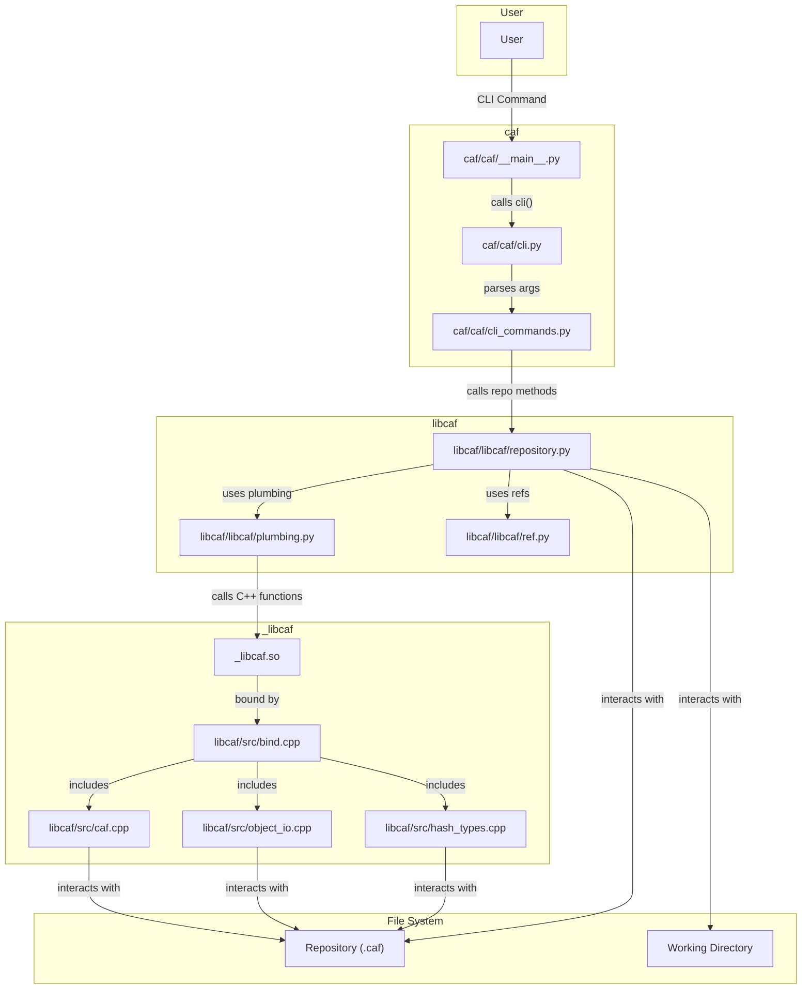

### Architectural Insights

The application is designed with a layered architecture that separates concerns effectively. At the top, the **Python CLI** (`caf` package) provides the user interface, parsing commands and arguments. It acts as a thin client, delegating all logic to the `libcaf` library.

The core logic resides in `libcaf`, which is split into a Python and a C++ layer. The **Python Core** provides a high-level, object-oriented API centered around the `Repository` class. This class orchestrates all repository operations, from initialization to committing and branching. It relies on the `plumbing.py` module for low-level, content-addressable storage operations and `ref.py` for reference management. The Python/C++ boundary is cleanly defined in `plumbing.py`, which acts as a bridge to the compiled C++ extension, `_libcaf.so`. This separation allows the bulk of the application logic to be written in Python, while performance-critical tasks are handled by C++.

The **C++ Core** is implemented as a native Python extension using `pybind11`. The `bind.cpp` file exposes C++ functions and data structures (like `Blob`, `Tree`, and `Commit`) to the Python interpreter. The C++ layer is responsible for the heavy lifting: hashing file contents, managing the object database, and performing file I/O. This hybrid approach combines Python's ease of development with the performance of C++. Data is persisted on the **File System**, with the `.caf` directory holding all repository data (objects, references), while the application interacts with the user's files in the working directory. Error handling is managed at each layer, with C++ exceptions being translated into Python exceptions at the boundary, allowing for consistent error handling throughout the Python codebase.